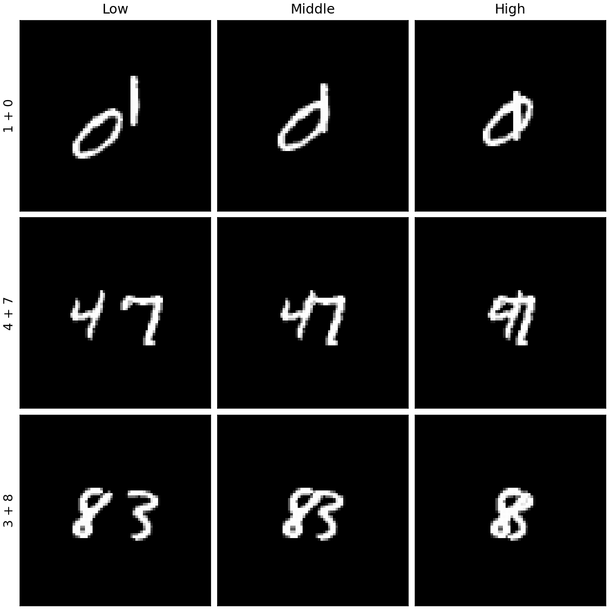

# MNIST Overlap Attention 결과 요약

## 실험 설정

- 모델: lenet, shared_attention, class_attention
- 데이터 seed: 2026
- 학습 seed: [0, 1, 2]
- Train: 60,000 images
- Validation: 3,330 pairs, 9,990 images
- Test: 10,000 pairs, 30,000 images
- 학습: Adam, learning rate 0.001, batch size 128, 최대 20 epochs
- Checkpoint 선택: validation Top-2 exact-match 기반 early stopping
- Test 주 지표: 두 정답 class를 모두 맞힌 Top-2 exact-match accuracy

## 핵심 결과

- LeNet 정확도는 Low에서 High로 21.78%p (95% CI [21.07, 22.50]) 감소했다.
- Seed-averaged High overlap에서 Class attention은 LeNet보다 0.37%p (95% CI [-0.15, 0.92]) 높았지만 신뢰구간이 0을 포함했다.
- Seed-averaged High overlap에서 Class attention은 Shared attention보다 0.81%p (95% CI [0.26, 1.35]) 높았고 신뢰구간이 0보다 컸다.
- Class attention의 LeNet 대비 개선 폭이 Low보다 High에서 더 커졌는지를 본 difference-in-differences는 -0.25%p (95% CI [-0.89, 0.40])로 0을 포함했다.
- 세 평균 정확도에서는 Class attention이 모든 overlap level에서 가장 높았지만, plain LeNet 대비 일관된 개선이라고 결론 내릴 근거는 충분하지 않았다.

## 분류 성능

값은 seed 0, 1, 2의 평균 ± 표본 표준편차다.

### Top-2 exact-match accuracy (%)

| Model | Overall | Low | Middle | High |
|---|---:|---:|---:|---:|
| LeNet | 79.43 ± 1.07 | 88.84 ± 0.74 | 82.38 ± 0.81 | 67.06 ± 1.98 |
| Shared attention | 78.96 ± 0.81 | 88.44 ± 0.08 | 81.82 ± 0.33 | 66.63 ± 2.09 |
| Class attention | 79.93 ± 0.81 | 89.47 ± 0.63 | 82.90 ± 0.81 | 67.43 ± 1.11 |

### Macro-F1

| Model | Overall | Low | Middle | High |
|---|---:|---:|---:|---:|
| LeNet | 0.8934 ± 0.0054 | 0.9434 ± 0.0037 | 0.9093 ± 0.0043 | 0.8275 ± 0.0096 |
| Shared attention | 0.8911 ± 0.0046 | 0.9413 ± 0.0005 | 0.9066 ± 0.0019 | 0.8253 ± 0.0123 |
| Class attention | 0.8963 ± 0.0043 | 0.9466 ± 0.0033 | 0.9121 ± 0.0042 | 0.8304 ± 0.0058 |

이 그림은 overlap level별 exact-match 평균과 seed 표준편차를 확대된 y축으로 표시한다. 확대 축은 작은 모델 차이를 읽기 위한 것이며 절대 성능 차이는 위 표의 수치로 판단한다.

## Paired bootstrap

세 seed의 sample별 correctness를 먼저 평균하고, Test의 동일 pair ID를 유지해 5,000회 재표집한 95% 신뢰구간이다. 이는 seed-averaged checkpoint의 test-pair 불확실성을 나타낸다.

| 비교 | 추정 차이 (%p) | 95% CI (%p) | 판단 |
|---|---:|---:|---|
| LeNet: Low − High | 21.78 | [21.07, 22.50] | 0 미포함 |
| High: Class − LeNet | 0.37 | [-0.15, 0.92] | 0 포함 |
| High: Class − Shared | 0.81 | [0.26, 1.35] | 0 미포함 |
| (Class − LeNet): High − Low | -0.25 | [-0.89, 0.40] | 0 포함 |

## 학습 seed 안정성

각 신뢰구간은 하나의 학습 seed 안에서 동일 test pair를 5,000회 재표집한 결과다. 따라서 해당 checkpoint의 test-pair 불확실성은 보여주지만 새 학습 seed에 대한 불확실성을 대신하지 않는다.

| 비교 | Seed | 추정 차이 (%p) | 95% CI (%p) |
|---|---:|---:|---:|
| LeNet: Low − High | 0 | 20.45 | [19.50, 21.43] |
| High: Class − LeNet | 0 | -2.79 | [-3.71, -1.87] |
| High: Class − Shared | 0 | -0.75 | [-1.64, 0.13] |
| (Class − LeNet): High − Low | 0 | -2.38 | [-3.45, -1.27] |
| LeNet: Low − High | 1 | 21.11 | [20.13, 22.10] |
| High: Class − LeNet | 1 | 0.53 | [-0.40, 1.44] |
| High: Class − Shared | 1 | 3.13 | [2.19, 4.06] |
| (Class − LeNet): High − Low | 1 | -0.48 | [-1.60, 0.62] |
| LeNet: Low − High | 2 | 23.78 | [22.79, 24.80] |
| High: Class − LeNet | 2 | 3.38 | [2.46, 4.30] |
| High: Class − Shared | 2 | 0.04 | [-0.81, 0.93] |
| (Class − LeNet): High − Low | 2 | 2.10 | [0.96, 3.18] |

High overlap의 Class−LeNet 구간은 양수 1개, 음수 1개, 0 포함 1개였다. Class−Shared 구간은 양수 1개, 음수 0개, 0 포함 2개였다. Seed 평균 차이는 양수지만 모든 학습 반복에서 같은 방향은 아니었다.

### Early-stopping 상태

| Model | Seed | 실행 epoch | Best epoch | Best val. | Final val. |
|---|---:|---:|---:|---:|---:|
| LeNet | 0 | 18 | 15 | 79.76% | 78.74% |
| LeNet | 1 | 18 | 15 | 78.22% | 77.90% |
| LeNet | 2 | 16 | 13 | 78.15% | 77.51% |
| Shared attention | 0 | 19 | 16 | 78.65% | 78.59% |
| Shared attention | 1 | 20 | 19 | 77.28% | 76.93% |
| Shared attention | 2 | 17 | 14 | 78.92% | 78.81% |
| Class attention | 0 | 17 | 14 | 78.87% | 78.01% |
| Class attention | 1 | 20 | 20 | 79.34% | 79.34% |
| Class attention | 2 | 19 | 16 | 80.95% | 80.34% |

Class attention에서 최대 20 epoch가 best였던 실행은 seed 1이다. 나머지 seed는 더 일찍 best checkpoint를 선택했으므로 모든 Class attention 실행이 공통으로 epoch 부족이었다고 보기는 어렵다.

## Attention 분석

IoU threshold는 각 seed의 validation set에서 선택한 뒤 test에 고정했다. 아래 값은 세 seed 평균 ± 표본 표준편차다.

| Model | Threshold | AUPRC | IoU | Cross-selectivity |
|---|---:|---:|---:|---:|
| Shared attention | 0.8667 ± 0.1041 | 0.1583 ± 0.1176 | 0.1035 ± 0.0724 | — |
| Class attention | 0.7833 ± 0.0289 | 0.1696 ± 0.0469 | 0.1158 ± 0.0205 | 0.0376 ± 0.0183 |

AUPRC와 IoU의 절대값은 두 attention 모델 모두 낮아, attention map을 숫자 획의 정밀한 segmentation으로 해석하기는 어렵다. Class attention의 평균은 Shared attention보다 약간 높았지만 이 차이에 대한 별도의 신뢰구간은 계산하지 않았다.

Class attention의 cross-selectivity 유효 sample 비율은 97.49%였다. Class map channel을 순환 교환하면 exact-match가 평균 50.70%로 낮아졌고, 정상 출력 대비 29.24%p 감소했다. 이는 학습된 class map과 output class의 연결이 prediction에 실제로 사용됐음을 보여준다.

그림은 seed 0 checkpoint가 동일한 `3+8` pair의 Low/Middle/High 입력에 출력한 실제 attention map이다. 정성 예시이므로 모델 전체의 attention 정렬은 위 정량 지표를 우선해 해석한다.

## 모델 크기와 계산 비용

MAC은 한 장의 `76×76` 입력을 forward할 때 Conv2d와 Linear 연산을 누적한 추정값이다.

| Model | Trainable parameters | MAC / image | LeNet 대비 MAC |
|---|---:|---:|---:|
| LeNet | 505,226 | 3,737,640 | 1.000× |
| Shared attention | 505,243 | 3,754,024 | 1.004× |
| Class attention | 505,396 | 8,415,880 | 2.252× |

Class attention은 parameter 증가는 작지만 class별 shared classifier를 반복하므로 LeNet보다 약 2.25배의 MAC을 사용한다.

## Class 및 숫자 조합별 오류 분석

| Model | 가장 낮은 평균 recall | 가장 어려운 High pair | 가장 쉬운 High pair |
|---|---:|---:|---:|
| LeNet | class 9: 83.88% | 3+4: 50.15% | 1+7: 86.19% |
| Shared attention | class 8: 83.61% | 3+8: 46.55% | 1+4: 84.98% |
| Class attention | class 9: 85.19% | 3+4: 48.20% | 1+4: 86.04% |

Heatmap의 각 cell은 seed별 sample correctness를 먼저 평균한 뒤 해당 unordered 숫자 조합에서 평균한 High-overlap exact-match다. 대각선은 같은 class 두 개를 데이터에 포함하지 않았기 때문에 흰색이다. 이 그림은 모델 순위보다 공통 난이도 패턴을 보는 보조 분석으로 사용한다.

## Controlled overlap 입력 예시

각 행은 `1+0`, `4+7`, `3+8` 조합이고 열은 Low, Middle, High다. 한 행 안에서는 MNIST 원본 두 장, pair 중심과 이동 방향을 유지하고 displacement만 변경했다. 따라서 level 간 성능 비교는 동일 pair의 overlap 강도 변화에 대응한다.

## 해석 범위

결과는 중앙 정렬된 서로 다른 class의 MNIST 숫자 두 개를 `76×76` canvas에서 maximum 합성한 조건에 한정된다. Class attention은 Shared attention보다 High-overlap 정확도가 높았지만 LeNet 대비 High-overlap 차이와 overlap 증가에 따른 상대 개선 폭은 신뢰구간이 0을 포함했다.

따라서 이 결과는 class-conditional attention이 모든 조건에서 plain CNN을 일관되게 개선한다는 근거로 해석하지 않는다. MultiMNIST의 state of the art, Capsule Network보다 우수함, 실제 객체 가림 문제로의 직접 일반화도 주장하지 않는다.

## 원본 결과 파일

- [모델 비교표](tables/model_comparison.csv)
- [Paired bootstrap 표](tables/bootstrap_intervals.csv)
- [Attention 분석표](tables/attention_metrics.csv)
- [모델 비용표](tables/model_costs.csv)
- [Seed별 paired 효과표](tables/seed_effects.csv)
- [학습 안정성표](tables/training_stability.csv)
- 세부 class 및 pair 결과는 `logs/metrics/`의 CSV에 저장된다.
